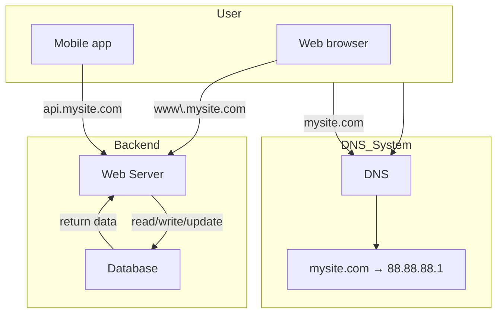
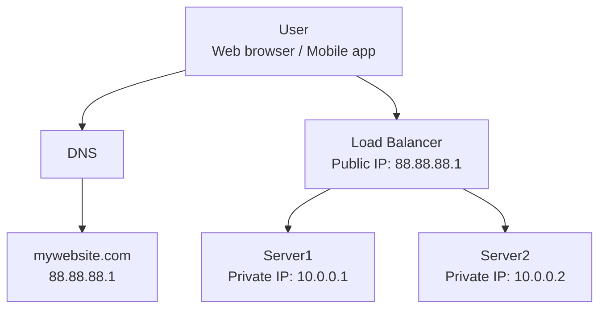
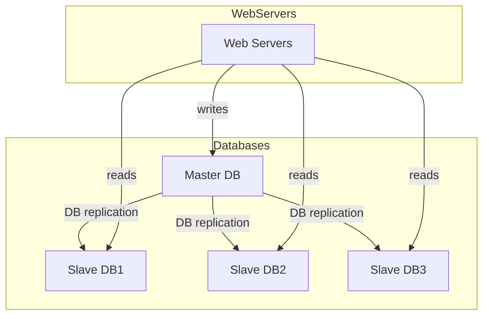
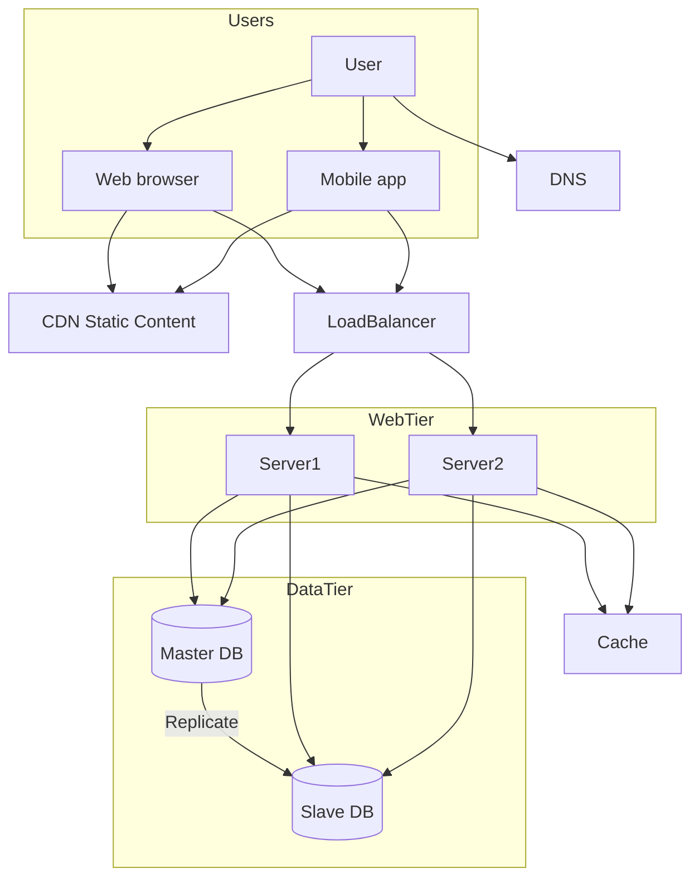

# System Design interview BOOK

Said to Framework and knowedge for open ended questions

# System Design Diagram: DNS, Load Balancer, and Servers

# Web App with DNS, Web Server, and Database

# SQL vs NoSQL Database Selection
| Use Case                                          | Relational DB (SQL) ✅ | Non-Relational DB (NoSQL) ✅ |
|---------------------------------------------------|------------------------|------------------------------|
| Complex relationships between entities            | ✅ Yes                 | ❌ No                        |
| Structured data with defined schema               | ✅ Yes                 | ❌ No                        |
| High consistency and ACID transactions needed     | ✅ Yes                 | ❌ No                        |
| Dynamic or unstructured data (JSON, XML, etc.)    | ❌ No                  | ✅ Yes                       |
| Super-low latency access                          | ❌ No                  | ✅ Yes                       |
| Massive scale / Big Data storage                  | ⚠️ Limited             | ✅ Yes                       |
| High write throughput                             | ❌ No                  | ✅ Yes                       |
| Simple key-value or document lookup               | ❌ Overkill            | ✅ Yes                       |
| Joins and complex queries                         | ✅ Yes                 | ❌ No                        |
| Evolving schema requirements                      | ❌ Rigid               | ✅ Flexible                  |

Scales:
- scale up vs scale out
- vertical:
    - has limits 
    - no failover and redundancy
Horizontal:
    - suitable for large scale app
    - load balancer 

- Now with load balancer, private ip should be used for communication between servers
- Load balancer should be in front of the web servers
- Now web tier failover is handled, what about the data tier?

## Data tier 
Use database cluster with master-slave replication
- Master-slave replication: one master, multiple slaves
- Master: write
- slave: read
- Most application much much higher read than write, so this is a good solution
- Master-slave replication is not a good solution for write-heavy applications, because the master can become a bottleneck. write heavy app: e.g. social network, chat app, etc. read heavy app: e.g. news site, blog, and e-commerce site.

advantage:
- better performance: parallel reads
- reliability: if 1 db desctropyed, data preserved, slave can promote
- avalability: if 1 db down, website still up, just slower

In practice, promoting a slave to master is complex: the slave may not have the latest data. 

# Cache
- when to use: read lots write little, cache is not persistent lost any time
- expiration not to long not too short:
    - frequent change: 30 s 
- Consistency: data store + cache in sync, icnonsistency can happen anytime: write-through, write-behind, or cache-aside
    - write-through: write to both data store and cache at the same time. Consistent but slow.
    - write-behind: write to cache first, then asynchronously write to data store. Fast but inconsistent.
    - cache-aside: read from cache first, if not found, read from data store and update cache. Fast but inconsistent.
- Mitigating failures: single cache server represents a potential single point of failure, if fails, stops system, so multiple cache recommended to avoid SPOF + Overprovisioning than required mem threshold 
- Eviction policy: once cache is full, evict some: LRU or LFU, or FIFO or random

# Content Delioevery Network (CDN)
- store static content: images, videos, css, js, files etc.
- further from CDN, the slower website loads, so the closest to the user serves the user.

flow:
1. user try to get image use url, the domain is provided by CDN provider, this is not the storage solution, though CDN needs to be configured to point to the storage solution, e.g. S3 bucket, or other storage solution.
2. First time CDN does not have image.png in cache, will request file from the origin, which can be a web server or online storage like S3 
3. The origin gives the image, and TTL in HTTP header, tells how long to cache
4. CDN cache the iamge, return to USER A
5. User B send request for same iamge, 
6. CDN has it in cache returns to User B 

# Considerations:
- cost: infrequent assets no significant benefits
- cache expiry: time senstive content: set edpiry: not too long, not too short
- CDN fallback: if CDN fails, should fetch from the origin
- Invalidateing files: remove a file from CDN before it expires: 
    - use API 
    - Use object versioning

# Key metrics:
1. cache Hit Ratio = cache hits / (cache hits + cache misses) 
2. Origin Fetch rate
3. Latency / response
4. Geo Performance
5. Error Rate
6. Bandwith Savings
7. Time to live TTL 
8. Throughput (RPS or MBPS)
9. Invalidation count/ rate
10. Content Load Distribution
11. Cost per GB . reques

# Sumamry:
- Keep web tier stateless
- Build redundancy at every tier 
- Cache data as much as you can 
- Support multiple data centers 
- Host static assets in CDN
- Scale your data tier by sharding 
- Split tiers into individual services
- Monitor your system and use automation tools

# Power of 2:
Data:
| power | size |
- 10  = 1 kb
- 20 = 1mb
- 30 = 1gb
- 40 = 1tb
- 50 = 1pb

Latency number: 
- 0.5 ns = L1 Cache reference
- 5 ns = Branch mispredict = 
- 7 ns = L2 cache reference
- 100 ns = mutex lock/unlock
- 100 ns - main memory reference
- 10 us = compress 1k with zippy
- 20 us = send 1 kb over 1 gbps network
- 250 us = read 1 mb sequentially from memory
- 500 us = round trip within the same data center 
- Disk seek = 10ms
- read 1mb from the netweek = 10ms
- read 1mb from disk = 30ms
- read 1mb from disk=30ms
- send packet CA -> Netherlands -> CA = 150ms
