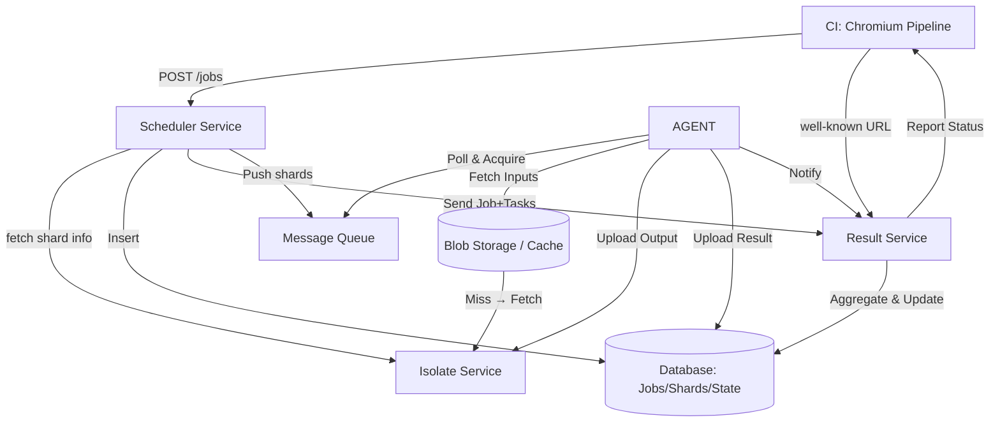
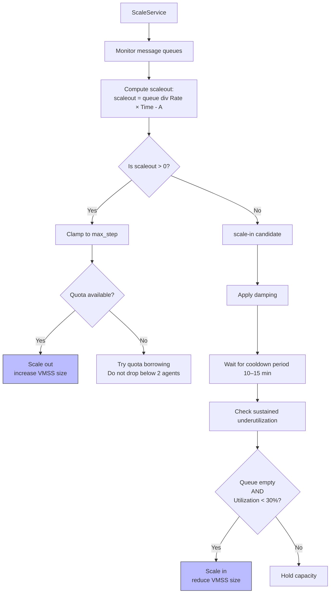
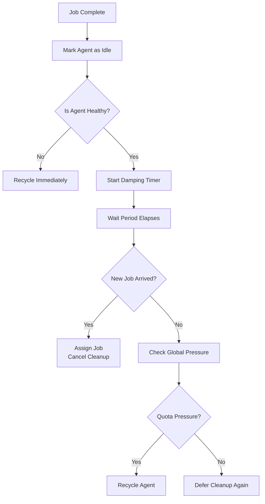

# Chromium Job Scheduling Architecture

## Components

- **CI**: Chromium build and test pipeline  
- **APP: Scheduler Service** – Receives jobs and schedules them into shards  
- **APP: Isolate Service** – Handles isolated inputs/outputs for shards
- **APP: Result Service** – accept a job_id, and list of tasks, aggregate shard results, and report eventual results
- **message queue**: Hold pending shards to be processed
    - windows11
    - windows10
    - windows10h
    - windows10sh
    - win7 nested
    - windows high 
    - mac
    - linux
    - android
    - ios
    - fuchsia
    - chromeos
    - 
- **VM + local app: AGENT:** listen on the message queue of the set type of OS, and process the shards
- **DATABASE: Services** – Stores job and shard metadata  
- **ScaleService**: if a message starts to build up in a message queue is too long, increase the virtual machine scaleset size by scaleout = queue/(Rate * Time) - A, if maximum reached, decrement other queue by sharing quota. But keep at least 2 vm for emergency.
---

## Workflow

1. **CI → Scheduler**: CI sends a build `job_id` to the Scheduler via `POST /jobs`.
1. **CI → Result-Service UI**: CI exposes a well-known URL to track job results.
1. **Scheduler → Isolate-Service**: Scheduler fetches the job and shard information from the Isolate Service. Construct a job to isolate one to many linked lists at this point scheduler knows if a shard needs to be scheduled on what OS.
1. **scheduler -> storage table** -> store job and shard in jobs table as init, stores shards in shard table as init, store states of tasks in table.
1. **Scheduler → Result Service**: Scheduler sends job id and a list of tasks to the results.
1. **Scheduler → Message Queue**: Scheduler sends each shard as a message to the Message Queue.
1. **Agents message queue**: Agents poll the Message Queue for new shards, if found 1, acquire, and process the shard.
1. **Agent -> cache (storageblob) -> Isolate Service**: fetch isolate service's shard info + + hash + files, if integrity matches, uses the result from isolate service. IF cache miss, upload it to cache.
1. **Agent** runs the test according to instruction given by the shard. If the shard is the same, it will finish in 10 seconds before results report back. If not the shard could be as quick as a couple of minutes or as long as 1 hour.
1. **Agent -> retry** if a shard failed to produce output, it will empty the repo flag itself for recycle.
1. **Agent → Isolate Service**: Agent uploads the compile test file, and test text result to the Isolate Service.
1. **Agent → shard table, result Service**: Agent uploads the test results text to shard table, notifiy result service.
1. **result service -> jobs shard table**: Result service when notified, gets status of all shards and update.
1. **result Service -> CI** unblock if success, throws if error when all job finishes or time out.

## Load Estimation

- **User Activity**:
  - 700 developers
  - Each pushes ~10 commits per day
  - Workday ≈ 10 hours

- **Estimated Throughput**:
  -  700 devs * 10 commits /workday  * 1workday/10 hours 1hr/ 3600seconds   approx =  0.2 jobs/second (average load)
  - database writes: 200 * 10 * 0.2 = 400 writes / second. 
  - seperate tables into different storage accounts because we saw service even though within bounds of 2000 WPS
  - Blob Storage: 100 / 300 mb per data per shard, 200 shards per job * 10 jobs per second = 2 GB / second 
  - total storage: 700 jobs×300 MB×200 shards=42,000,000 MB = 40TB a day, a month =  1 Pb
  - **Peak load** (e.g., during promotional, pump, or release pipelines): ~**39.44 QPS** to `POST /jobs`

---

## Sharding

- Each job can be sharded into **50–200 shards** 
- developer shards at most 2-10 shard runs.
- Shards are scheduled and executed in parallel
- Scheduler and Isolate Service coordinate execution and isolation

## My Contribution:
- **ScaleService**: Monitors each message queue. If a queue builds up too long, increase the corresponding VM Scale Set size using:

  `scaleout = queue / (Rate × Time) - A`

  Where:
  - `queue`: number of pending shards
  - `Rate`: average processing rate per agent (shards/sec)
  - `Time`: target time to process pending shards (e.g. 300s)
  - `A`: current number of active agents

  - If `scaleout > 0`:
    - **Clamp** to a maximum scale step (`max_step`)
    - **Respect overall VM quota**: if max reached, try to **borrow quota from other underutilized queues** (fair sharing), but **never reduce any queue below 2 agents** to preserve emergency capacity.

  - If `scaleout < 0` (scale-in case):
    - Apply **damping** before actually scaling down.
    - Wait for a **cooldown period** (e.g., 10–15 minutes).
    - Require consistent underutilization for multiple intervals before scaling down.
    - Use **hysteresis**: only scale in if queue is empty and agent utilization is <30%.

## recycler
