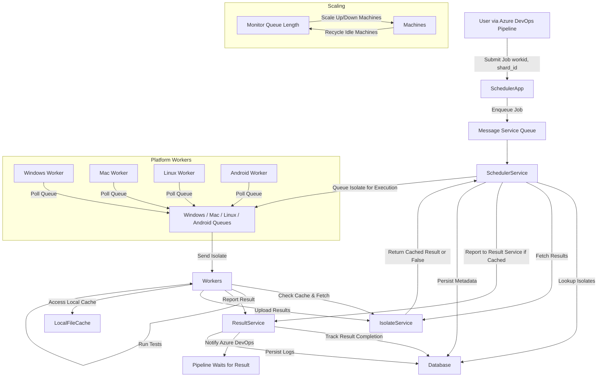

1. Isolate service:
   1. fetch: given a isolate_id, integrity_id, return files + result of the tests if existing and integrity_id matches, if not existing, or integrity_id does not match return false
   2. store: store files, result isolate_id, and compute a files integrity id
2. scheduler service: given jobs definition: a job id and a list of isolates, find what isolates are associated with it, then fetch results from isolate service, if existing report to the result service, if not existing, send send each isolate to its set queue: windows, mac, linux, android etc.
3. A message service keep a queue of jobs to be secueduled
4. ScaleService: constantly scans, monitors the length of the queue, if the queue is large, spawn up more jobs, if the queue is small, or empty decrease machines. Machine do not get recycled right away if they finish, they remove work dir. if extended period of time, then recycles.
5. machines are grouped by their system, each machine internally has a worker, they constantly poll the queue to recieve jobs, if a job arrive, they fetch the isolate from the isolate service, run the tests, and report the result to the result service, as well as upload to isolate service. The worker also has a cache of files, if a file is already in the cache, it does not need to be fetched again.

6. database: jobs, isolates, results, machines, queues, shard_log, results log, machines
7. the result service was give job id, and list of isolates, it will track the results of the job, and report to its endpoint when all results are available, or if a timeout occurs, it will report the result of the job as failed.

8. the user submits a job via azure devops pipeline, the pipeline sends a request to the endpoint of a scheduler app with content {workid, shard_id, } the pipeline will then wait for the result of the job via the result service.

flow:

The user submit tests via azure devops pipeline. The pipeline sends a request to the endpoint of a scheduler app with content {workid, shard_id, }

The app

User (via Azure DevOps Pipeline)
        |
        v
+-------------------+
|   Scheduler App   | <--- Receives {workid, shard_id}
+-------------------+
        |
        v
+-------------------+
|   Message Queue   |  <-- Holds pending jobs
+-------------------+
        |
        v
+------------------------+
|   Scheduler Service    |
+------------------------+
        |
        |---> fetch isolates from --> Isolate Service
        |                               |
        |                               v
        |                        +-------------------+
        |                        |  Isolate Service   | ->db
        |                        |  (fetch / store)   |
        |                        +-------------------+
        |
        |---> if cached --> report to Result Service -> db
        |---> if not cached --> enqueue to:
        |        | 
        |        +---> Windows Queue
        |        +---> Mac Queue
        |        +---> Linux Queue
        |        +---> Android Queue

+------------------------+
|     Scale Service      | <-- Monitors queue size -> db
+------------------------+
        |
        v
+------------------------+
|   Machine Pool (by OS) | <-- Spawns or recycles machines
+------------------------+
        |
        v
+------------------------+
|     Worker Agent (per OS)    | -> db
|  - Polls queue         |
|  - Fetches isolate     |
|  - Runs tests          |
|  - Uses file cache     |
|  - Stores result       |
|  - Reports result      |
+------------------------+
        |
        v
+-------------------+
|  Result Service   | <--- Tracks job completion
|  - Waits for all  |
|  - Or times out   |
|  - Reports result |
+-------------------+
        |
        v
+-------------------+
|  ack to pipeline  | <-- Stores report results 
+-------------------+